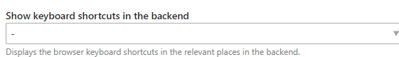

[](https://packagist.org/packages/tastaturberuf/contao-display-keyboard-shortcuts-bundle)
[](https://contao.org)
[](https://github.com/Tastaturberuf/contao-display-keyboard-shortcuts-bundle)
[](https://github.com/Tastaturberuf/contao-display-keyboard-shortcuts-bundle/commits/main)

# Contao Display Keyboard Shortcuts

Displays the browser keyboard shortcuts in the relevant places in the backend.
**Now you can visually learn and use the shortcuts.**

## Backend

To activate this feature you can use the select menu in the user configuration.



*The backend setting in the user configuration.*

You can choose from various styles:


*Superscript*


*Text*


*Keyboard*

## Install

### via Composer

```
composer require tastaturberuf/contao-display-keyboard-shortcuts-bundle
```

### via Contao Manager

search for `tastaturberuf/contao-display-keyboard-shortcuts-bundle`

➡ [Link to the Contao Extension Repository](https://extensions.contao.org/?p=tastaturberuf%2Fcontao-display-keyboard-shortcuts-bundle)

## Translations

- [ ] Chinese - 中文(简体)
- [ ] Czech - Čeština
- [ ] Dutch - Nederlands
- [x] English - English
- [x] French - Français
- [x] German - Deutsch
- [ ] Italian - Italiano
- [ ] Japanese - 日本語
- [ ] Latvian - Latviešu
- [ ] Persian - فارسی
- [x] Polish - Polski
- [ ] Portuguese - Português
- [ ] Russian - Русский
- [ ] Serbian - Српски
- [x] Spanish - Español

## Maintainer

[Tastaturberuf](https://tastaturberuf.de) **with ♥ and Contao**